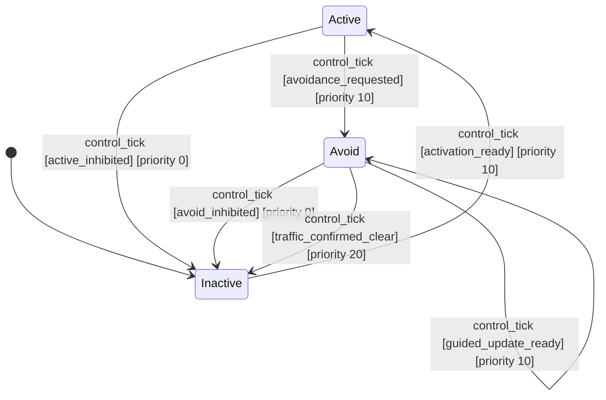

# ArduCopter Collision Avoidance

This figure documents the private collision-avoidance prototype in
[`arducopter_collision_avoidance.py`](arducopter_collision_avoidance.py). The
controller evaluates one `control_tick` against an immutable snapshot of the
latest aircraft and collision-system facts. Lower numeric priorities are
evaluated first, and the first eligible candidate wins.

## State Diagram



## State Responsibilities

| State | Responsibility | Aircraft command behavior |
|---|---|---|
| **Inactive** | Collision avoidance is unavailable or inhibited. This is the initial and safety fallback state. | Issues no flight command. |
| **Active** | The collision system is healthy and monitoring while the aircraft remains in `AUTO`. | Issues no flight command. |
| **Avoid** | An actionable collision alert has taken control through ArduCopter Guided mode. | Issues the initial Guided reposition command on entry and accepts fresh Guided target updates while remaining in this state. |

Returning to `Inactive` from `Avoid` deliberately sends neither a neutral
target nor an `AUTO` mode command. The last accepted Guided command remains in
effect. Normal automatic flight resumes only after the pilot selects `AUTO`;
the controller never selects `AUTO` itself.

## Shared Eligibility Rule

Several guards use the pure `base_eligible` rule. It is true only when all of
the following facts are true at the same control tick:

- Aircraft telemetry heartbeat is fresh.
- Collision-system heartbeat is fresh.
- Collision status data is fresh.
- Collision-system readiness has remained stable for its configured dwell time.
- The pilot's collision-avoidance switch is enabled.
- Aircraft altitude is inside the inclusive minimum and maximum limits.
- Critical battery, low battery, and lost-link failsafes are all false.
- The aircraft is neither landing nor on the ground.

This common rule does not choose a transition. It supplies the liveness and
safety facts used by the named transition guards below.

## Transition Guards

### `activation_ready`

```text
base_eligible
AND flight mode is AUTO
```

This is the only way to move from `Inactive` to `Active`. Selecting `AUTO`
alone is insufficient when telemetry is stale, the collision system is not
ready, the switch is disabled, altitude is out of bounds, or a safety
inhibition is present.

### `active_inhibited`

```text
NOT activation_ready
```

This priority-0 guard returns `Active` to `Inactive` whenever any activation
requirement stops being true. That includes the pilot changing away from
`AUTO`. It is evaluated before `avoidance_requested`, so an alert cannot engage
Guided mode during the same tick that monitoring becomes unsafe or ineligible.

### `avoidance_requested`

```text
activation_ready
AND Guided retry cooldown is satisfied
AND alert level is at or above the configured avoidance threshold
AND an avoidance command is available
AND its sequence is newer than the last dispatched command
```

This moves `Active` to `Avoid`. After the state transition commits, the entry
callback sends one `MAV_CMD_DO_REPOSITION` carrying both the first target and
the `CHANGE_MODE` request. A rejected or timed-out engagement starts a retry
cooldown to prevent a rapid request loop.

### `avoid_inhibited`

```text
NOT base_eligible
OR Guided confirmation failed or timed out
OR flight mode is neither:
   - GUIDED, nor
   - AUTO while Guided confirmation is still pending
```

This is the priority-0 safety exit from `Avoid`. Remaining briefly in `AUTO` is
allowed only while the combined Guided engagement request is awaiting
confirmation. Once Guided has been confirmed, a pilot selection of `AUTO`
causes this guard to exit avoidance. Other mode changes—including `RTL` or
`LAND` selected by an ArduCopter failsafe—also exit immediately.

### `guided_update_ready`

```text
base_eligible
AND flight mode is GUIDED
AND alert level is at or above the avoidance threshold
AND an avoidance command is available
AND its sequence is newer than the last dispatched command
```

This priority-10 self-transition keeps the FSM in `Avoid` and sends a
`SET_POSITION_TARGET_GLOBAL_INT` update. Duplicate command sequences do not
produce duplicate aircraft commands. The guard cannot send an update before
ArduCopter telemetry confirms `GUIDED`.

### `traffic_confirmed_clear`

```text
collision heartbeat is fresh
AND collision status data is fresh
AND collision readiness is stable
AND alert level is below the avoidance threshold
```

This priority-20 guard returns `Avoid` to `Inactive` only on a fresh,
authoritative below-threshold status. Missing or stale collision data is never
interpreted as an all-clear. If a safety inhibition and an all-clear are both
present, `avoid_inhibited` wins because priority 0 is evaluated first.

## Candidate Resolution by State

```text
Inactive + control_tick
  10 activation_ready       -> Active

Active + control_tick
   0 active_inhibited       -> Inactive
  10 avoidance_requested    -> Avoid

Avoid + control_tick
   0 avoid_inhibited        -> Inactive
  10 guided_update_ready    -> Avoid
  20 traffic_confirmed_clear -> Inactive
```

A failed guard falls through to the next candidate. If no candidate is
eligible, the state and aircraft command remain unchanged. A guard exception
aborts candidate resolution rather than falling through.

## State Adjacency Matrix

| → | Active | Avoid | Inactive |
|---|---|---|---|
| **Active** | — | `control_tick` [priority 10] | `control_tick` [priority 0] |
| **Avoid** | — | `control_tick` [priority 10] | `control_tick` [priority 0], `control_tick` [priority 20] |
| **Inactive** | `control_tick` [priority 10] | — | — |

## Transition and Command Effects

| From | Guard | To | Priority | Post-commit effect |
|---|---|---|---:|---|
| Inactive | `activation_ready` | Active | 10 | None |
| Active | `active_inhibited` | Inactive | 0 | None |
| Active | `avoidance_requested` | Avoid | 10 | Send initial `MAV_CMD_DO_REPOSITION` with `CHANGE_MODE` |
| Avoid | `avoid_inhibited` | Inactive | 0 | Reset engagement bookkeeping; leave the last Guided target untouched |
| Avoid | `guided_update_ready` | Avoid | 10 | Send fresh `SET_POSITION_TARGET_GLOBAL_INT` target |
| Avoid | `traffic_confirmed_clear` | Inactive | 20 | Reset engagement bookkeeping; leave the last Guided target untouched |

## Audit Coverage

The Fast FSM validator checks the state graph, reachability, candidate priority
ordering, and structural completeness. The companion standalone audit in
[`audit_arducopter_collision_avoidance.py`](audit_arducopter_collision_avoidance.py)
evaluates the pure guards over the complete abstract input fact space and
asserts the safety, command, timeout, and altitude-boundary invariants. It is a
prototype audit tool and is intentionally not part of Fast FSM's package test
suite.
