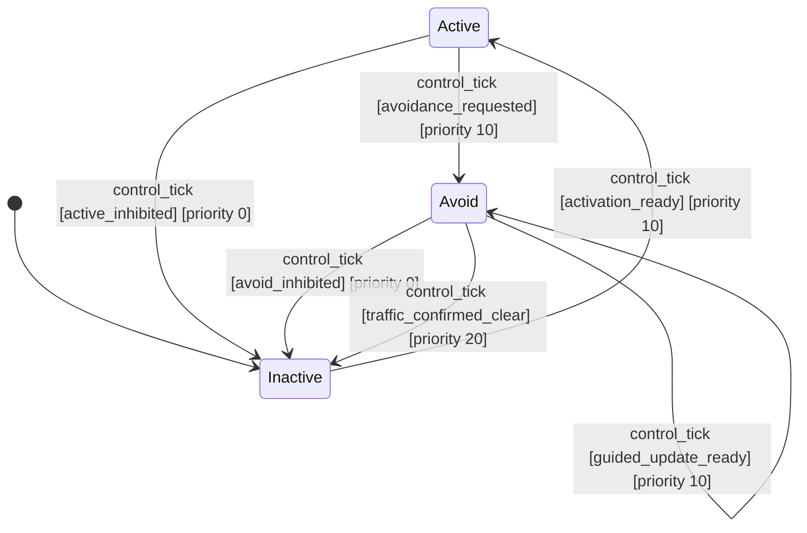

# ArduCopter Collision Avoidance

## State Diagram

## State Adjacency Matrix

| → | Active | Avoid | Inactive |
|---|---|---|---|
| **Active** | — | `control_tick` [priority 10] | `control_tick` [priority 0] |
| **Avoid** | — | `control_tick` [priority 10] | `control_tick` [priority 0], `control_tick` [priority 20] |
| **Inactive** | `control_tick` [priority 10] | — | — |

## Transitions

| # | From | Event | To | Priority |
|---|------|-------|----|----------|
| 0 | Active | `control_tick` | Inactive | 0 |
| 1 | Active | `control_tick` | Avoid | 10 |
| 2 | Avoid | `control_tick` | Inactive | 0 |
| 3 | Avoid | `control_tick` | Avoid | 10 |
| 4 | Avoid | `control_tick` | Inactive | 20 |
| 5 | Inactive | `control_tick` | Active | 10 |
